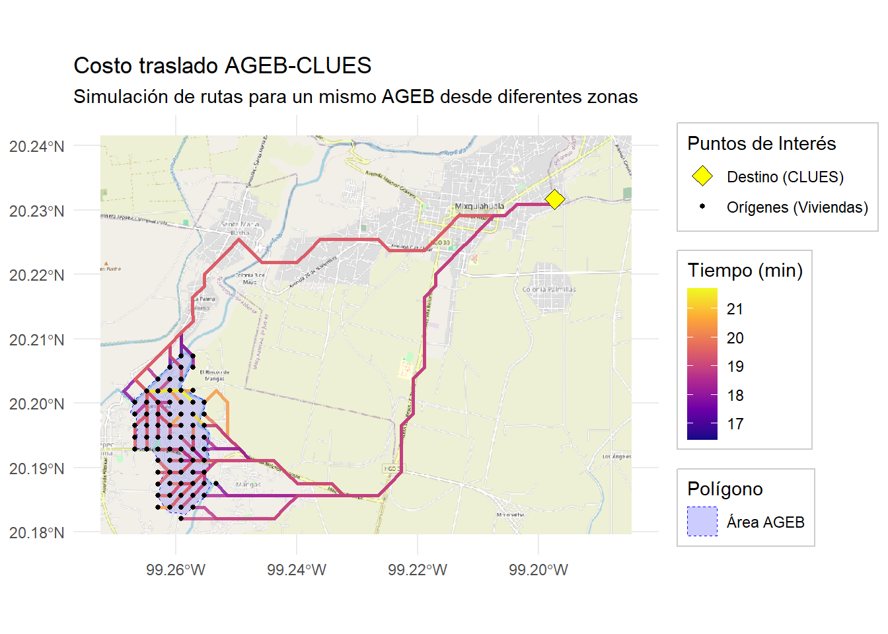
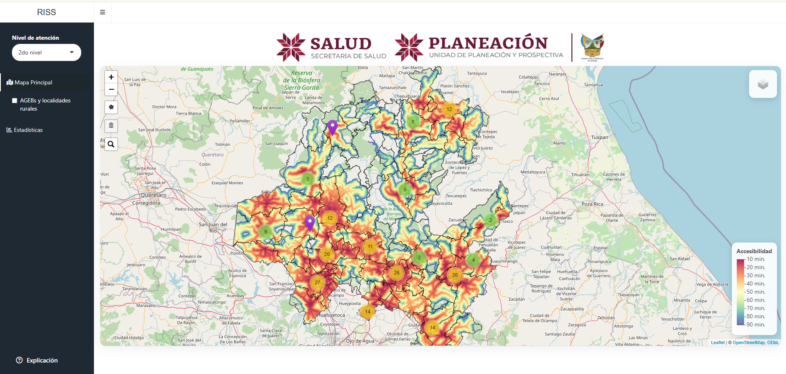
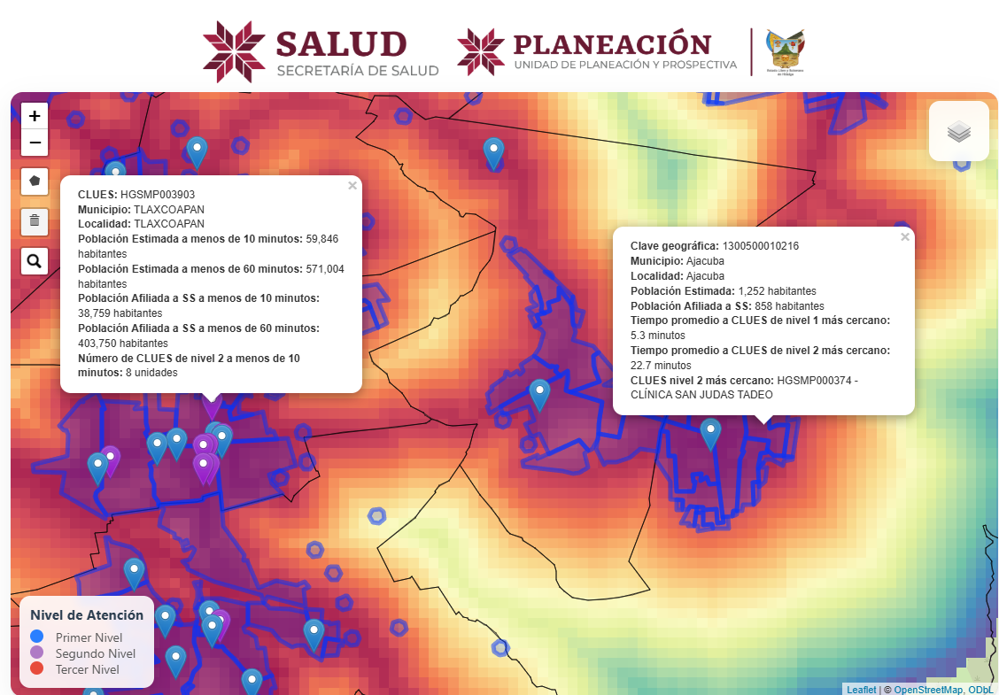

# Visualizador de la accesibilidad y cobertura de la infraestructura de salud a nivel estatal

Este repositorio presenta una propuesta técnica y reproducible para caracterizar la cobertura sanitaria a partir de datos geográficos, demográficos y de accesibilidad. La visualización integra distintos niveles de análisis espacial para identificar zonas con menor cobertura en términos de tiempo de viaje a servicios de salud.

Se define la accesibilidad como el costo (en unidades de tiempo) de recorrer el camino más cercano entre dos ubicaciones geográficas. 
Para este proyecto, se generaliza el cálculo de costo para lidiar con ubicaciones de tipo polígono. De esta manera, la accesibilidad entre una localidad (o AGEB) y un centro de salud (CLUES), se define como el costo promedio de recorrer los caminos más cercanos entre ubicaciones tomadas de manera uniforme sobre la localidad, y un CLUES (Figura 1). De esta manera, podemos identificar a las localidades más alejadas (en tiempo) a hospitales y centros de salud. 

  

<em>Figura 1. Concepto de accesibilidad promediada entre una localidad y un CLUES.</em>

Se puede consultar una documentación de este proceso en: [Cálculos de accesibilidad y rutas óptimas entre polígonos y puntos](https://jairesc.github.io/RISS_Salud_CEIEGH/documentacion/calculos_accesibilidad.html)

---

## Insumos

Hasta ahora, se establece periodicidad anual o semestral para las actualizaciones de:

- CLUES georreferenciados y clasificados por nivel de atención y sector público/privado.
- SINERHIAS del sector público, con catálogo y variable tipo boolean para el equipamiento, clasificada por nivel de atención.
- Capacidad de atención (en proceso), incluyendo datos de morbilidad a nivel de CLUES y un subconjunto de padecimientos por definir.

Por definirse, queda la actualización de los AGEBs, localidades urbanas y rurales. Esta versión utiliza el marco geoestadístico de INEGI, diciembre de 2020; se consideró 2025, pero requeriría hacer match entre datos demográficos de 2020 y cartográficos de 2025.

---

## Procesos

- Construcción única del modelo de accesibilidad carretera mediante isocronas SIGEH.
- Incorporación de API de Mapbox para la consulta de isocronas a niveles fijos de 10, 20, 40 y 60 minutos para puntos variables (CLUES/AGEBs). Se excluye por simplicidad.
- Ejecución única de códigos:
  - no_usar_calculos_accesibilidad_clues.R
  - no_usar_calculos_rasters_accesibilidad.R

En caso de ser necesario, existe una versión dockerizada para la generación de insumos.

### Avance principal

*Completado*: Cálculo del número de personas a más de X minutos -> pestaña de cobertura.

Resumen. Se toman tres cartografías del marco geostadístico de INEGI:

- AGEB
- Localidad urbana (tipo polígono)
- Localidad rural (tipo punto)

Se satisface que cualquier AGEB pertenece a una única localidad urbana (AGEB es partición de localidades urbanas). Se considera un buffer de 150 m alrededor de las localidades rurales para tomarlas como polígono. En un futuro podrían reemplazarse algunos polígonos por versiones más actuales, por ejemplo el marco geostadístico de 2025.

Se aplica una simplificación para disminuir el tamaño (MB) de los polígonos. La unión de estas geometrías y datos demográficos de SCINCE definen la primera base.

Para cuatro conjuntos de CLUES seleccionados (Nivel 1, Nivel 2, Nivel 3 y todos los anteriores), se calcula el raster de accesibilidad general y se agregan los tiempos promedio de accesibilidad a cada polígono de acuerdo con su intersección con el raster (extract). Esto define el segundo checkpoint: datos demográficos más accesibilidad promedio por nivel.

Con este avance, es trivial determinar el nombre y tiempo promedio del CLUES de nivel 2 más cercano. Se fija la columna calculada anteriormente para determinar el tiempo mínimo a un hospital y se realiza un join por vecino más cercano (st_join(st_nearest_feature)) para obtener clave de CLUES y nombre de la unidad. Se agregan como columnas y se guarda el progreso.

Para calcular el número de CLUES (de nivel N) se considera el subconjunto de pixeles con intersección no vacía al polígono (AGEB) y se calcula la distancia de cada uno de los centroides de los pixeles a todos los CLUES seleccionados. Comentario técnico: de haberse tomado el centroide del polígono, los AGEBs grandes podrían tener información poco precisa; se considera que el promedio de centroides de pixeles que cubren el polígono es un mejor acercamiento.

Comentario técnico: como es de esperarse, el costo computacional es alto. Dada la periodicidad de actualización de la información, no parece valer la pena optimizar la actualización de estos datos; sin embargo, podría almacenarse la matriz de costos inter-CLUES y agregar filas y columnas conforme se actualicen. Se utiliza una librería especializada en extracts para mejorar los tiempos de ejecución.

### Resultados intermedios

- Cuántas opciones tiene cada AGEB de cada nivel: pre-calculado y mostrado en modal.
- Cuántas opciones tiene cada AGEB de cada nivel a qué tiempos: pre-calculado y mostrado en modal.
- CLUES nivel 2 más cercano (nombre) y tiempo: pre-calculado y mostrado en modal.

*Pendiente*: incorporar capacidades de atención por CLUES.

### Diagrama de tecnologías

[Diagrama de tecnologías en draw.io](https://drive.google.com/file/d/1JwbSRxKlOHuxOyDfWusGGSZM02ikZuwh/view?usp=sharing)

---

## Productos

*Pendiente*: regionalización como producto final.

### Evidencia visual del proyecto

  

<em>Vista general del visualizador en operación.</em>

  

<em>Detalle de la información geográfica y demográfica asociada a CLUES y AGEB.</em>

